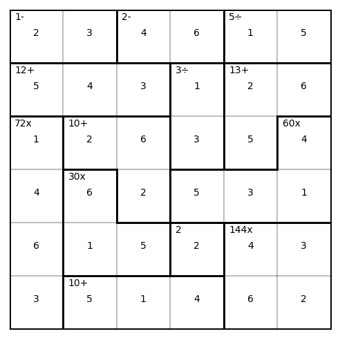

# Generator for Calcudoku puzzles in Python

## Installation

```
pip install calcudoku
```

## Example


```python
from calcudoku.game import Calcudoku
from calcudoku.visualize import save_figure

game = Calcudoku.generate(6)

save_figure(game, 'puzzle.png', solution=False)
save_figure(game, 'puzzle_solution.png', solution=True)
```


